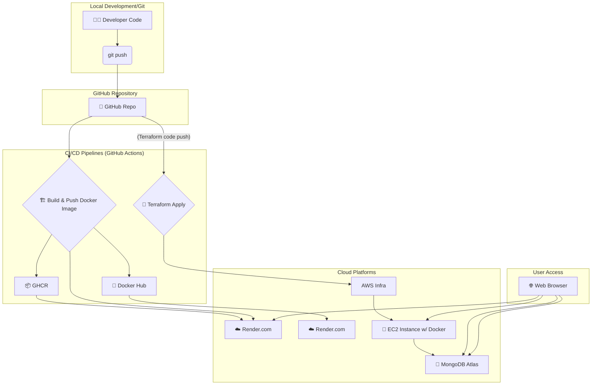

# 🚀 TaskFlow: Smart DevOps-Driven Task Management System

---

## 📌 Project Overview

TaskFlow is a modern, full-stack task management application designed with a strong emphasis on DevOps principles and cloud-native architecture. It serves as a comprehensive portfolio project showcasing advanced skills in:

- 🏗️ Infrastructure as Code
- 🐳 Containerization
- 🔁 CI/CD pipelines
- ☁️ Cloud deployment on AWS

The application allows users to:
- 👤 Register & Log in
- ✅ Manage tasks with attributes like `title`, `description`, `type`, `priority`, and `status`

---

## 🛠️ DevOps Journey & Key Technologies

### 🧠 Backend
- 📦 **Technology Stack:** Node.js, Express.js
- 💾 **Database:** MongoDB Atlas (Cloud-hosted NoSQL Database)
- 🔐 **Authentication:** JWT (JSON Web Tokens)
- 🐳 **Containerization:** Docker

### 🎨 Frontend
- 💻 **Technology Stack:** HTML, CSS (Tailwind CSS), JavaScript
- 🧩 **Purpose:** Simple and responsive interface for interacting with the backend API

---

## ✨ Core DevOps Features

### 🏗️ Infrastructure as Code (IaC) with Terraform & AWS:

- 🪄 **Automated Provisioning** using Terraform to set up AWS infrastructure:
  - 🏢 VPC
  - 📍 Public Subnets
  - 🌐 Internet Gateway & 📑 Route Tables
  - 🛡️ Security Groups (SSH, HTTP, HTTPS)
  - 📡 EC2 Instance
  - 📬 Elastic IP
  - 💾 S3 Bucket
  - 🧮 DynamoDB Table

- ♻️ **Repeatable Deployments** for multiple environments
- 🔄 **Version Controlled** via Git
- 💣 **Automated Destruction** of infrastructure

### 🐳 Containerization with Docker:

- 📦 Node.js app is packaged into a container
- 🌍 Runs consistently across environments

### 🔁 CI/CD with GitHub Actions:

- 🏗️ **Docker Image Build:** triggered on backend code changes
- 📤 **Push to Registries:**
  - 📦 GitHub Container Registry
  - 🐙 Docker Hub

- 🎯 **Deploy to Render:** via secure deploy hook after image build
- 📜 **Deploy Infrastructure:** trigger `terraform apply` on `devops/terraform/aws/` changes
- 🔐 **Secrets Managed:** via GitHub Secrets (AWS, Docker, JWT, Mongo, Render)

### ☁️ Cloud Deployment Strategy:

- 🧪 **Initial (Render.com):** Unified deployment for fast access
- ⚙️ **Advanced (AWS EC2):**
  - 🔑 SSH into instance
  - 🐳 Install Docker
  - 📥 Pull and 🏃 Run image

---

## 🗺️ Project Architecture



---

## 🏁 Getting Started

### 📋 Prerequisites
- 📦 Node.js
- 🐳 Docker
- 🧪 Git
- ☁️ AWS Account
- 💾 MongoDB Atlas
- 🔗 Render.com

### 🖥️ Local Development
```bash
git clone https://github.com/Mohd2040/TaskFlow.git
cd TaskFlow
```

#### 🔙 Backend Setup
```bash
cd backend
npm install
cp .env.example .env
# Edit .env
npm start
```

#### 💻 Frontend Access
Open `backend/public/index.html` in your browser.

### ☁️ Cloud Deployment (AWS via Terraform)

#### ⚙️ AWS Setup
- Create AWS Account
- IAM User w/ EC2, VPC, S3, DynamoDB access
- 💾 S3 Bucket (e.g., `taskflow-terraform-state-<name>`) with versioning
- 🧮 DynamoDB Table (e.g., `taskflow-terraform-locks`)
- 🔐 EC2 Key Pair (e.g., `taskflow-ssh-key`)

#### 🔐 GitHub Secrets
- `AWS_ACCESS_KEY_ID`
- `AWS_SECRET_ACCESS_KEY`
- `SSH_KEY_NAME`
- `DOCKER_HUB_USERNAME`
- `DOCKER_HUB_TOKEN`
- `RENDER_DEPLOY_HOOK`

#### 📜 Terraform Configuration
```bash
cd devops/terraform/aws/
# Ensure tf files are properly configured
# Push to main branch
```

GitHub Actions will auto-deploy infrastructure.

#### 📡 EC2 Deployment (Manual)
```bash
# SSH into instance
ssh -i taskflow-ssh-key.pem ubuntu@<EC2_PUBLIC_IP>

# Install Docker
sudo apt update
sudo apt install docker.io -y
sudo systemctl start docker
sudo systemctl enable docker
sudo usermod -aG docker ubuntu
```

#### 🏃 Run Docker Image
```bash
# docker login (Hub or GHCR)
docker pull your-username/taskflow-backend:latest

docker run -d -p 80:5000 \
  -e MONGO_URI="..." \
  -e JWT_SECRET="..." \
  --name taskflow-app \
  your-username/taskflow-backend:latest
```

Access via Public IP in browser 🔍

---

## 💡 Future Enhancements
- 🤖 Automate EC2 setup (User Data / Ansible)
- 🔁 Load Balancer (ALB)
- 📈 Auto Scaling
- 📊 CloudWatch / Monitoring
- 🧱 MongoDB IaC
- 🧪 Add Tests to CI/CD
- 🔐 HTTPS via ACM

---

## 🤝 Contribution
We welcome your contributions! 🙌

---

## 👨‍💻 Developed By
**Mohamed AbuShallouf 🇵🇸**
    🔗 Upwork Profile
    🔗 LinkedIn
    🔗 GitHub